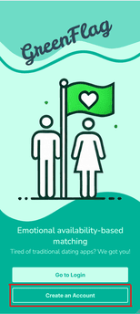
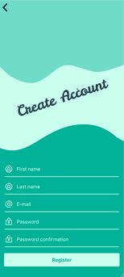
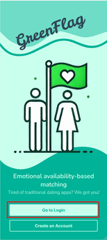
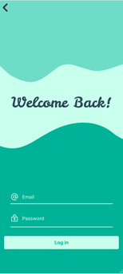
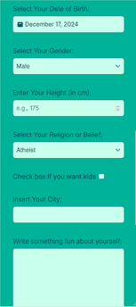
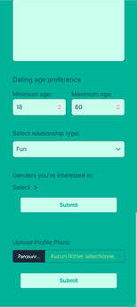
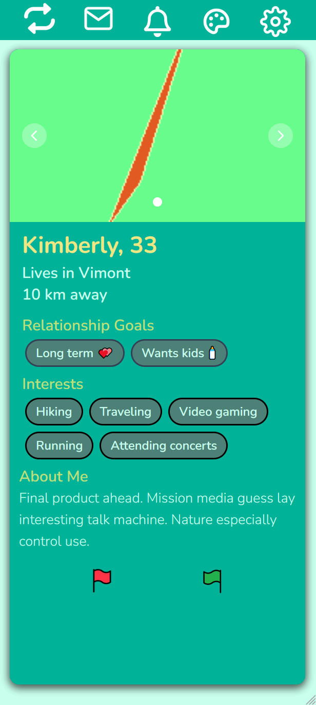

# Green Flag
## to-do:
* Il est attendu que pour chaque fichier de code se trouve un en-tête standardisé qui contient au minimum le nom du fichier (introspection), le contexte de ce fichier, que retrouve-t-on ici? (une très courte phrase), le nom de l’auteur ou des auteurs. Tentez de déterminer un standard élégant et de le respecter dans tous les fichiers.
### par Vincent Fournier et Bettina-Sarah Janesch

## Présentation
Une introduction succincte au projet, exposant son but et les éléments clés.

## Installation
Requirements:
Python
VSCode
Postgres avec comme user: postgres et une base de donnée: postgres
Node.js

*Il est préférable d'utiliser VSCode pour la majorité des opérations.*
1. Ouvrir le dossier GreenFlag avec VSCode.
2. Dans le terminal VSCode entrer: pip install -r requirements.txt
3. Par la suite dans l'explorateur système, allez dans le dossier GreenFlag/dev/database et exécuter le fichier run_database.sh ou run_database_windows.ps1 si vous n'avez pas Git Bash
4. Dans le terminal VSCode entrer une à la fois les commandes qui suit:
cd .\dev\frontend\
npm install
npm run dev
5. Dans le debugger de VSCode sélectionner la configuration 'fill DB' et appuyer sur F5
6. Toujours dans le debugger de VSCode sélectionner la configuration 'run server' et appuyer sur F5

Vous pouvez maintenant utiliser l'application à l'addresse localhost:5173

## Utilisation
La première étape serait de créer un nouveau compte.
 
Après avoir donner son email et mot-de-passe, se connecter une première fois.
 
Lors de cette première connection, on vous demande de remplir un formulaire afin d'en connaitre plus
sur vous et de nous aider à trouver des usagers qui pourrais vous intérresser.
  
Vous êtes par la suite redirigé vers la page des matchs où vous pouvez dès maintenant
accepter ou refuser des suggestions de partenaires qui vous sont offertes.

Dès qu'une suggestion est réciproquement acceptée, un match devrait être crée et une notification
devrait vous être donner par laquelle vous serez redirigé à la discussion du match à l'aide d'un clic.

Dans ce dernier, il vous est possible en temps réel d'envoyer et de recevoir des messages.

## Utilisation TEST

  

    La première étape serait de créer un nouveau compte.
  

  

     
    
  

  

    Après avoir donner son email et mot-de-passe, se connecter une première fois.
  

  

     
    
  

  

    Lors de cette première connection, on vous demande de remplir un formulaire afin d'en connaitre plus
    sur vous et de nous aider à trouver des usagers qui pourrais vous intéresser.
  

  

     
     
    
  

  

    Vous êtes par la suite redirigé vers la page des matchs où vous pouvez dès maintenant
    accepter ou refuser des suggestions de partenaires qui vous sont offertes.
  

  

    
  

  

    Dès qu'une suggestion est réciproquement acceptée, un match devrait être crée et une notification
    devrait vous être donner par laquelle vous serez redirigé à la discussion du match à l'aide d'un clic.
    Dans ce dernier, il vous est possible en temps réel d'envoyer et de recevoir des messages.
  

  

    <!-- Vous pouvez insérer une image ici si nécessaire -->
  

## Références
Une compilation des ressources et des références principales consultées durant le
développement du projet, avec des liens hypertextes le cas échéant.
ChatGpt https://chatgpt.com/
Scikit-Learn Github Repo https://github.com/scikit-learn/scikit-learn/blob/6e9039160/sklearn/cluster/_mean_shift.py#L302 for the algorithm Meanshift

## Contact
### Vincent Fournier
Github: vincentfournier127
email: vincentfournier.127@gmail.com
### Bettina-Sarah Janesh
Github: bettina-sarah
email: bettina.sarah.janesch@gmail.com

## Remerciements
On remercie Pierre-Paul Monty pour son aide et ses conseils sur les algorithmes,
Frédéric Thériault pour ses conseils frontend qui nous ont permis à mieux nous enligner dans notre projet
et pour finir Erik Freundorfer pour ses conseils frontend