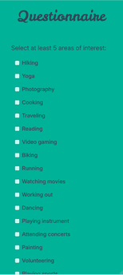

# Green Flag

### par Vincent Fournier et Bettina-Sarah Janesch

## Présentation
Greenflag est une application web de rencontres qui emploie des algorithmes afin de trouver des partenaires avec des intérêts similaires. Elle permet également la communication entre les utilisateurs en temps réel et la possibilité de signaler un usager pour mauvais comportement. Il y a également un système de notification connectée avec le mécanisme de matching et chat, ainsi qu’une gestion de session qui génère des jetons JWT qui rend l’application plus sécuritaire.

## Installation
Requirements:
- Python
- VSCode
- Postgres avec comme user: postgres et une base de donnée: postgres
- Node.js

Exécuter l'un des scripts installation (installation.ps1(PowerShell) ou installation.sh(Bash))\
Passer à l'étape 5 si le script à fonctionner sinon suivre les opérations manuels\
\
Opérations Manuels\
*Il est préférable d'utiliser VSCode pour la majorité des opérations.*
1. Ouvrir le dossier GreenFlag avec VSCode.
2. Dans le terminal VSCode entrer: pip install -r requirements.txt
3. Par la suite dans l'explorateur système, allez dans le dossier GreenFlag/dev/database et exécuter le fichier run_database.sh ou run_database_windows.ps1 si vous n'avez pas Git Bash
4. Dans le terminal VSCode entrer une à la fois les commandes qui suit:
cd .\dev\frontend\
npm install 

  

5. Dans le terminal VSCode entrer: npm run dev
6. Dans le fichier constants.py dans GreenFlag/dev/backend/DAOs
7. Dans le debugger de VSCode sélectionner la configuration 'fill DB' et appuyer sur F5
8. Toujours dans le debugger de VSCode sélectionner la configuration 'run server' et appuyer sur F5

Vous pouvez maintenant utiliser l'application à l'addresse localhost:5173

## Utilisation
### La première étape serait de créer un nouveau compte.
 \

### Après avoir donner son email et mot-de-passe, se connecter une première fois.
 \

### Lors de cette première connection, on vous demande de remplir un formulaire afin d'en connaitre plus sur vous et de nous aider à trouver des usagers qui pourrais vous intérresser.
  \
### Vous êtes par la suite redirigé vers la page des matchs où vous pouvez dès maintenant accepter ou refuser des suggestions de partenaires qui vous sont offertes.
\

### Dès qu'une suggestion est réciproquement acceptée, un match devrait être crée et une notification devrait vous être donner par laquelle vous serez redirigé à la discussion du match à l'aide d'un clic.
 \
\
### Dans ce dernier, il vous est possible en temps réel d'envoyer et de recevoir des messages.

## Références

Scikit-Learn Github Repo https://github.com/scikit-learn/scikit-learn/blob/6e9039160/sklearn/cluster/_mean_shift.py#L302 for the algorithm Meanshift
Cours sur React https://frontendmasters.com/courses/complete-react-v9/
Documentation React https://react.dev/
Documentation TypeScript https://www.typescriptlang.org/docs/
ChatGpt https://chatgpt.com/

## Contact
### Vincent Fournier
Github: vincentfournier127 \
email: vincentfournier.127@gmail.com 
### Bettina-Sarah Janesh
Github: bettina-sarah \
email: bettina.sarah.janesch@gmail.com

## Remerciements
On remercie Pierre-Paul Monty pour son aide et ses conseils sur les algorithmes,
Frédéric Thériault pour ses conseils frontend qui nous ont permis à mieux nous enligner dans notre projet
et pour finir Erik Freundorfer pour ses conseils frontend.
